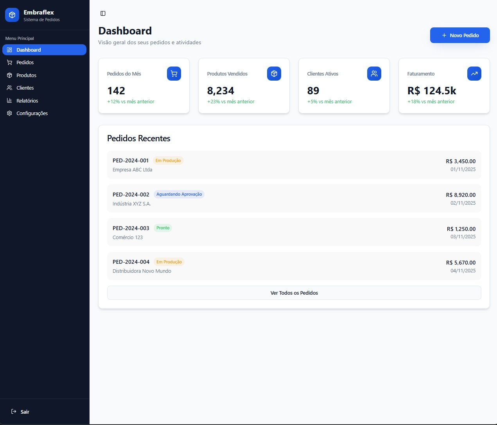

# Embraflex - Sistema de Pedidos Digital

Sistema web desenvolvido para gerenciamento de pedidos, produtos e clientes da Embraflex. Construído com tecnologias modernas para proporcionar uma experiência rápida e intuitiva.

## Preview



*Dashboard principal do sistema com visão geral de pedidos, produtos, clientes e faturamento.*

## Tecnologias Utilizadas

### Core
- **React 18.3.1** - Biblioteca para construção de interfaces
- **TypeScript 5.8.3** - Superset JavaScript com tipagem estática
- **Vite 5.4.19** - Build tool e dev server de alta performance
- **React Router DOM 6.30.1** - Roteamento client-side

### UI e Estilização
- **Tailwind CSS 3.4.17** - Framework CSS utilitário
- **Radix UI** - Componentes acessíveis e sem estilo
- **Lucide React** - Biblioteca de ícones
- **Shadcn/ui** - Sistema de componentes reutilizáveis
- **Class Variance Authority** - Gerenciamento de variantes de componentes

### Gerenciamento de Estado e Dados
- **TanStack React Query 5.83.0** - Gerenciamento de estado assíncrono
- **React Hook Form 7.61.1** - Formulários performáticos
- **Zod 3.25.76** - Validação de schemas TypeScript-first

### Integração e API
- **Axios** - Cliente HTTP para requisições
- **WooCommerce REST API v3** - Integração com catálogo de produtos

### Notificações e Feedback
- **Sonner** - Sistema de toast notifications
- **Radix UI Toast** - Componente de toast acessível

## Estrutura do Projeto

```
src/
├── componentes/
│   ├── layouts/
│   │   └── DashboardLayout.tsx    # Layout principal com sidebar
│   ├── ui/                         # Componentes de interface reutilizáveis
│   │   ├── button.tsx
│   │   ├── card.tsx
│   │   ├── input.tsx
│   │   ├── select.tsx
│   │   ├── sidebar.tsx
│   │   └── ...
│   ├── AppSidebar.tsx             # Navegação lateral
│   └── NavLink.tsx                # Componente de link de navegação
├── pages/
│   ├── Dashboard.tsx              # Visão geral e métricas
│   ├── Login.tsx                  # Autenticação
│   ├── Orders.tsx                 # Listagem de pedidos
│   ├── NewOrder.tsx               # Criação de pedidos
│   ├── Products.tsx               # Gerenciamento de produtos
│   ├── Customers.tsx              # Gerenciamento de clientes
│   ├── Reports.tsx                # Relatórios e análises
│   └── Settings.tsx               # Configurações do sistema
├── hooks/                          # Custom hooks
├── lib/
│   ├── utils.ts                   # Funções utilitárias
│   └── woocommerce.ts             # Serviço de integração WooCommerce
├── app.tsx                        # Configuração de rotas
└── main.tsx                       # Entry point da aplicação
```

## Funcionalidades

### Dashboard
- Visão geral com métricas principais (pedidos, produtos, clientes, faturamento)
- Lista de pedidos recentes com status
- Indicadores de tendência comparados ao mês anterior
- Acesso rápido para criar novos pedidos

### Gerenciamento de Pedidos
- Listagem completa de pedidos
- Criação de novos pedidos
- Filtros e busca
- Status de pedidos (Em Produção, Aguardando Aprovação, Pronto)

### Gerenciamento de Produtos
- Integração com catálogo WooCommerce
- Listagem de produtos com imagens
- Busca por nome de produto
- Filtros e ordenação
- Paginação de resultados
- Exibição de preços e estoque
- Categorias de produtos
- Atualização em tempo real

### Gerenciamento de Clientes
- Cadastro e edição de clientes
- Visualização de informações detalhadas

### Relatórios
- Análises e métricas do negócio
- Visualização de dados consolidados

### Sistema de Autenticação
- Tela de login
- Proteção de rotas
- Redirecionamento automático

## Configuração e Instalação

### Pré-requisitos
- Node.js 16+ ou superior
- Yarn ou npm

### Instalação

```bash
# Clone o repositório
git clone <url-do-repositorio>

# Entre no diretório
cd step2

# Instale as dependências
yarn install
# ou
npm install

# Configure as variáveis de ambiente
cp .env.example .env
# Edite o arquivo .env com suas credenciais do WooCommerce
```

### Desenvolvimento

```bash
# Inicie o servidor de desenvolvimento
yarn dev
# ou
npm run dev
```

O servidor estará disponível em `http://localhost:5173`

### Build para Produção

```bash
# Build otimizado
yarn build
# ou
npm run build

# Preview do build de produção
yarn preview
# ou
npm run preview
```

### Build de Desenvolvimento

```bash
# Build sem otimizações de produção
yarn build:dev
# ou
npm run build:dev
```

## Linting

```bash
# Execute o ESLint
yarn lint
# ou
npm run lint
```

## Configuração do WooCommerce

O sistema integra-se com a API REST do WooCommerce para gerenciar produtos. Para configurar:

### 1. Gerar credenciais no WooCommerce

1. Acesse o painel do WordPress/WooCommerce
2. Navegue para **WooCommerce > Configurações > Avançado > REST API**
3. Clique em **Adicionar chave**
4. Configure:
   - **Descrição**: Sistema de Pedidos Embraflex
   - **Usuário**: Administrador
   - **Permissões**: Leitura/Gravação
5. Copie as credenciais geradas (Consumer Key e Consumer Secret)

### 2. Configurar variáveis de ambiente

Edite o arquivo `.env` na raiz do projeto:

```env
VITE_WOOCOMMERCE_URL=https://seu-site.com.br
VITE_WOOCOMMERCE_CONSUMER_KEY=ck_sua_chave_aqui
VITE_WOOCOMMERCE_CONSUMER_SECRET=cs_seu_secret_aqui
```

### 3. Reiniciar o servidor

Após configurar, reinicie o servidor de desenvolvimento para aplicar as mudanças.

Para mais detalhes sobre a integração, consulte o arquivo `WOOCOMMERCE_CONFIG.md`.

## Configuração de Paths

O projeto utiliza path aliases configurados no TypeScript e Vite:

- `@/` - Aponta para `./src/`

Exemplo de uso:
```typescript
import { Button } from "@/componentes/ui/button"
import { cn } from "@/lib/utils"
import { getProducts } from "@/lib/woocommerce"
```

## Design System

O projeto implementa um design system consistente com:

- Cores temáticas HSL configuráveis
- Gradientes personalizados
- Sistema de sombras padronizado
- Modo claro e escuro
- Componentes responsivos
- Animações suaves

### Principais Cores
- **Primary**: Azul (#3B82F6)
- **Secondary**: Verde (#10B981)
- **Success**: Verde (#10B981)
- **Warning**: Laranja (#F59E0B)
- **Destructive**: Vermelho (#EF4444)

## Funcionalidades da Integração WooCommerce

### Produtos
- Listagem completa com paginação
- Busca por nome
- Filtros por categoria e status
- Exibição de imagens
- Informações de estoque
- Preços formatados
- Categorias

### Endpoints Disponíveis
- `getProducts(params)` - Lista produtos com filtros
- `getProductById(id)` - Busca produto específico
- `getCategories()` - Lista categorias

## Próximos Passos

- Integração de pedidos com WooCommerce
- Integração de clientes com WooCommerce
- Implementação de autenticação real
- Sistema de permissões de usuário
- Criação de pedidos direto no WooCommerce
- Exportação de relatórios em PDF
- Notificações em tempo real
- Dashboard com gráficos interativos
- Sincronização de estoque

## Licença

Propriedade da Embraflex. Todos os direitos reservados.

